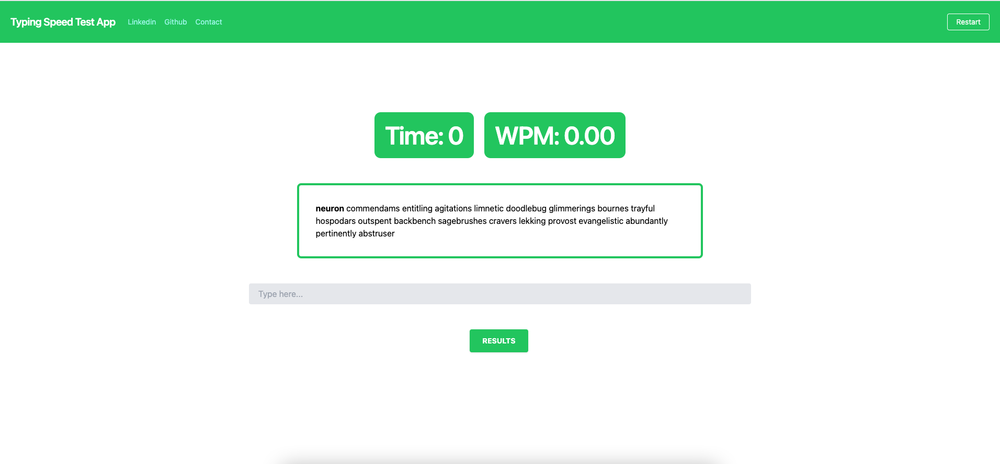
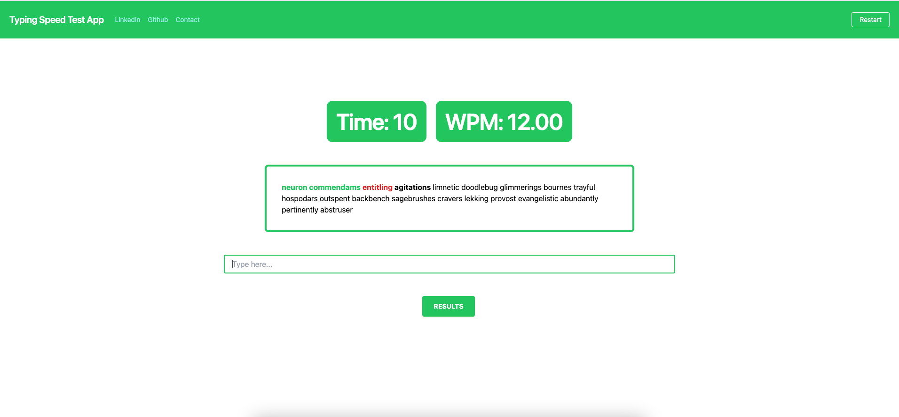
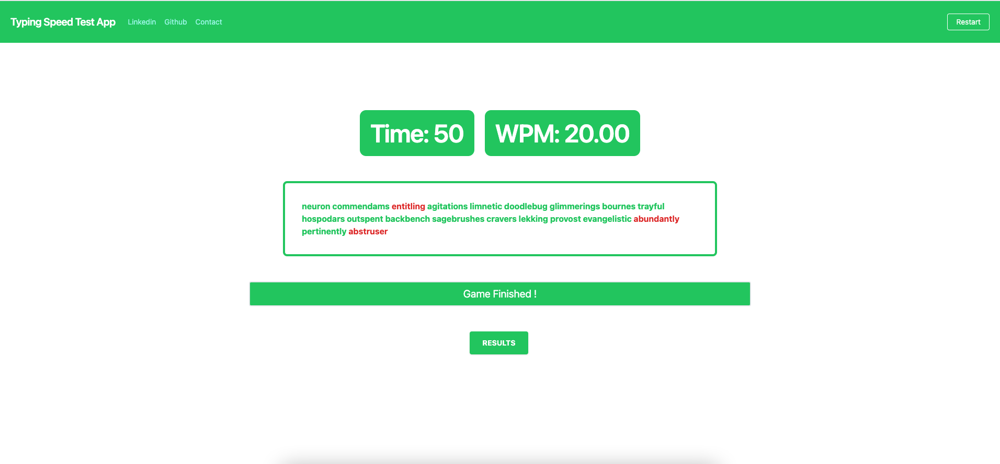
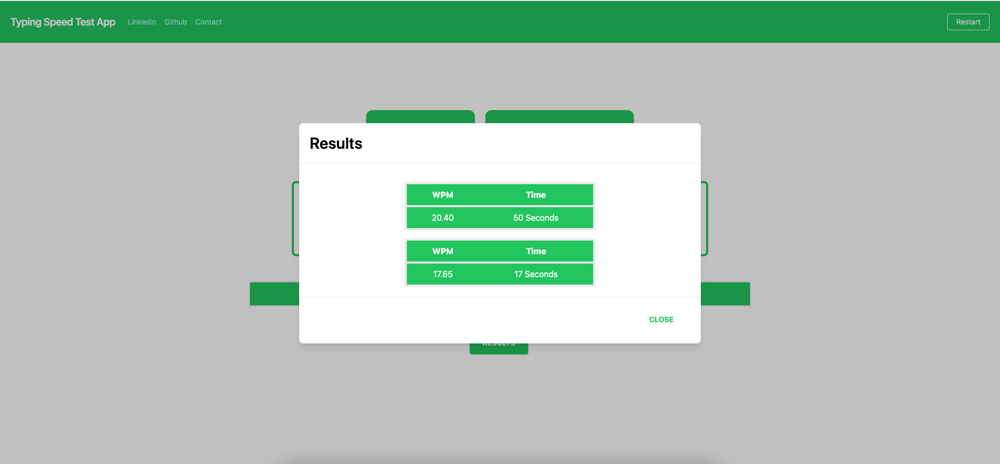

<h1 align="center">
  :zap: Typing Speed Test App :zap:
</h1>
<h2>
  About :grey_question:
</h2>

  This is an app that collects users typing speed data with time and words per minute. 
     
  <strong><em>Here is the live version:</em></strong>https://typing-speed-4un.pages.dev/

<h2>
  Flow :ocean:
</h2>

  When you start the app it welcomes you with a 'Get Words' button that fetches 20 random words from api. After you click that button the app displays a loading spinner and shows the 20 fetched randomized words from the api when the loading stops. 
When the user starts typing in the input field, the timer and WPM start to work. At the end of 20 words, the game is over and the results are saved in Local Storage by storing Time and WPM data. The saved data can be accessed from the 'Result' button. If the user wishes, he/she can restart the game from the 'Restart' button in the upper right.   

<h2>
  Stack :rocket:
</h2>
 <ul>
      <li>React</li>
      <li>Typescript</li>
      <li>Tailwind</li>
      <li>Hooks</li>
      <li>LocalStorage</li>
      <li>Axios</li>
</ul>
  
<h2>
  Screenshots :camera_flash:
</h2>

<h3>
  Main Screen
</h3>

<h3>
  Game Flow
</h3>

<h3>
  Finished
</h3>

<h3>
  Results
</h3>

 

 
